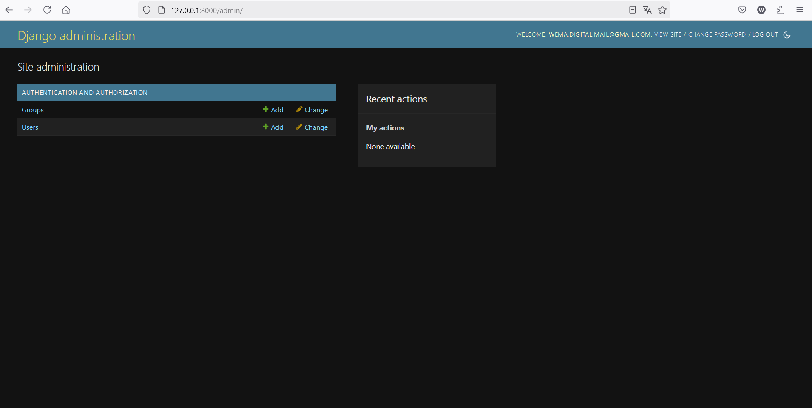

# Project Title: [webase](https://github.com/pira245/webase)

## About

An intuitive Django project for managing descriptions efficiently, featuring a user-friendly interface, dynamic filtering, and seamless database integration.

### Why Use This Version?

This project helps developers learn how to create a Django applications efficiently.

## Installation

Follow these steps to set up the project on your local machine:

### 1. Clone the Repository

```bash
git clone https://github.com/pira245/webase.git
```

### 2. Create a Virtual Environment

#### Using Conda

```bash
conda create --name my_env --file requirements.txt
```

#### Using Pip

```bash
pip install -r requirements.txt
```

### 3. Run the Application

```bash
python main.py
```

## Getting Started

Ideal scenarios and use cases for starting with this project.

### Screenshots

Below are some screenshots showcasing the project interface:

<div style="display: flex; justify-content: space-around;">
    
    
    
</div>

### Features

This project includes the following features:

- Basic Server Setup
- Built-in Django authentication
- Settings for sqlite3 (default)

## Contact

For any inquiries, please reach out via email:

📧 **Email:** ricardo.pirabed@gmail.com


